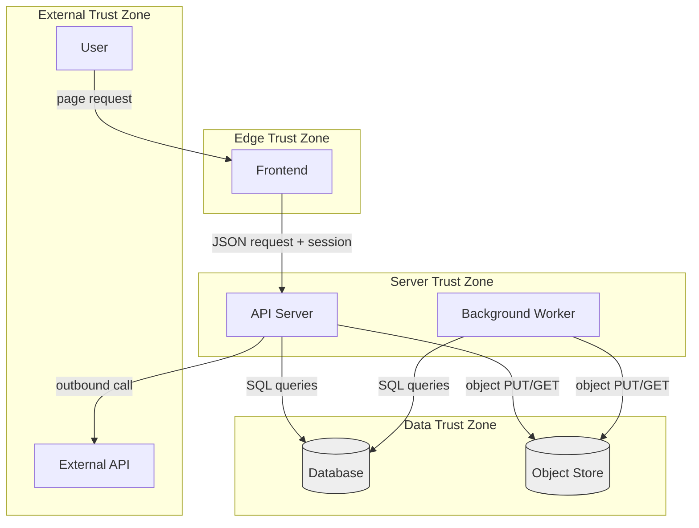
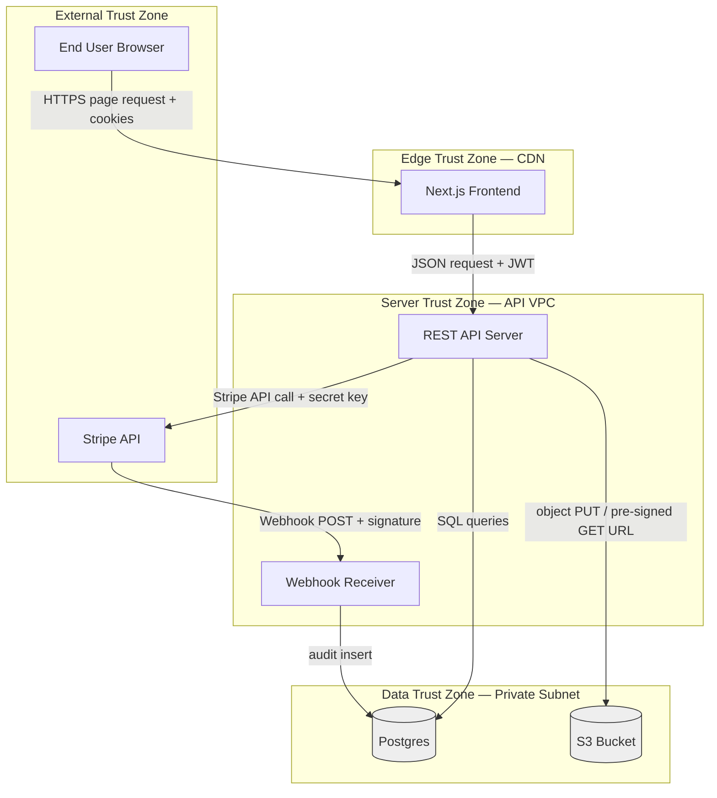

# DataFlowDiagram

A Data Flow Diagram (DFD) makes a threat model concrete. It marks every
process, store, and flow, and it makes trust boundaries visible. STRIDE and
MAESTRO both produce noise without a DFD because the analyst is reasoning
about an unspecified system. With a DFD, every category question is anchored
to an element on the page.

This workflow produces three artifacts:

1. A Mermaid DFD with explicit trust boundaries.
2. A trust-boundary table summarizing what crosses each boundary and what
   threats arise.
3. A short list of ISCs derived directly from the boundaries (transport,
   authentication, integrity).

## Notation

The DFD uses five primitives:

- **Actor** — an external entity that initiates or receives flows. Drawn as a
  rounded rectangle. Examples: end user, third-party API, batch scheduler.
- **Process** — software that transforms data. Drawn as a rectangle.
  Examples: API server, worker, frontend bundle.
- **Data store** — a place where data rests. Drawn as a cylinder. Examples:
  Postgres, S3 bucket, Redis cache.
- **Data flow** — labelled arrow between elements. The label is what crosses,
  not the protocol. Examples: "credentials", "session token", "uploaded file".
- **Trust boundary** — a dashed enclosing rectangle around a region of
  uniform trust. Boundaries are crossed by flows that change zone. Each
  crossing is a threat-rich location.

Rules:

- Every flow that crosses a trust boundary deserves a row in the
  trust-boundary table.
- Every store inside a trust boundary inherits that zone's protections.
- Actors are always outside every internal trust boundary, by definition.

## Mermaid template



Replace the placeholders. Each `subgraph` is a trust boundary. Add or remove
boundaries to match the system. Keep the boundary list and the table aligned.

## Trust boundary table format

| ID | Boundary                        | What crosses                                  | What threats arise                                                                  |
| -- | ------------------------------- | --------------------------------------------- | ----------------------------------------------------------------------------------- |
| TB-1 | External ↔ Edge               | Page requests, login attempts                 | Spoofing, DoS, transport tampering                                                  |
| TB-2 | Edge ↔ Server                 | JSON requests with session token              | Spoofing, IDOR, injection, CSRF                                                     |
| TB-3 | Server ↔ Data                  | SQL queries, object operations                | Tampering via SQL injection, IDOR, leakage from query joins                         |
| TB-4 | Server ↔ External             | Outbound API calls, webhooks                  | Spoofing of remote, tampering of in-flight, secret leakage in logs                  |

Add a row for every boundary. The column "What threats arise" is the input to
STRIDE or MAESTRO for that boundary.

## Worked example: user → Next.js frontend → REST API → Postgres + S3 + external Stripe API

System under analysis: a SaaS application. The frontend is a Next.js app
running on a CDN. The backend is a REST API server. The data tier is Postgres
plus S3. The application calls Stripe for payments and receives Stripe
webhooks.

### Mermaid DFD



The diagram shows three internal trust boundaries:

- TB-1, External ↔ Edge: between the user's browser and the CDN-hosted
  frontend, and between Stripe and our webhook receiver.
- TB-2, Edge ↔ Server: between the frontend (rendered code that runs in the
  user's browser, even if served from our CDN) and the API server.
- TB-3, Server ↔ Data: between the API server and the data tier.
- TB-4, Server ↔ External: between our API and Stripe outbound.

Note: TB-1 covers two flows because the External zone has two actors: end
users and Stripe. Stripe webhooks specifically cross from External to a
Server-zone receiver, not via the Edge.

### Trust boundary table

| ID   | Boundary                 | What crosses                                                | What threats arise                                                                                                                          |
| ---- | ------------------------ | ----------------------------------------------------------- | ------------------------------------------------------------------------------------------------------------------------------------------- |
| TB-1a | User ↔ Edge            | HTTPS page requests, login form posts, session cookies      | Cookie theft over downgraded TLS, CSRF, credential phishing, replay                                                                         |
| TB-1b | Stripe ↔ Webhook       | Signed webhook POSTs                                        | Forged webhook posing as Stripe, replayed webhook, missing signature verification                                                           |
| TB-2  | Edge ↔ Server          | JSON requests carrying JWT and user inputs                  | Spoofing via stolen JWT, IDOR via user-controlled IDs, injection via unparameterized queries, oversized payload DoS                         |
| TB-3  | Server ↔ Data          | SQL queries, S3 PUT/GET, pre-signed URL issuance            | SQL injection, query-side leakage from over-broad joins, S3 path traversal, pre-signed URL TTL too long                                     |
| TB-4  | Server ↔ Stripe        | Outbound API calls carrying Stripe secret key, idempotency keys | Secret leakage in logs, retry storms causing duplicate charges, MITM if certificate pinning absent, error-handling leaking customer data |

### ISCs derived from the boundaries

```
- [ ] ISC-1: All edge-to-user traffic is served over TLS 1.2+ with HSTS preload.
- [ ] ISC-2: Session cookies are flagged Secure, HttpOnly, SameSite=Strict.
- [ ] ISC-3: All Stripe webhook posts are HMAC-verified using the Stripe-Signature header before any state change.
- [ ] ISC-4: Stripe webhooks are idempotent: each event_id is processed at most once.
- [ ] ISC-5: All API requests carrying user-controlled identifiers are authorized using the session-derived user_id, not the input.
- [ ] ISC-6: SQL queries are constructed only via parameterized statements; concatenation fails CI lint.
- [ ] ISC-7: Pre-signed S3 URLs are scoped to a single object key with a TTL ≤ 5 minutes.
- [ ] ISC-8: Outbound calls to Stripe verify the certificate against the Stripe CA bundle.
```

These eight ISCs come directly from the boundary table. STRIDE on the
processes inside each zone produces the rest. `SecurityISCs.md` contains the
deterministic translation.
